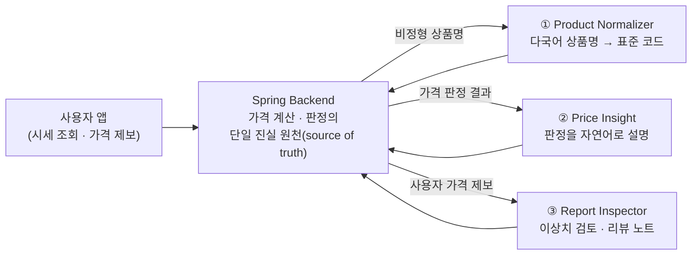

# BozorCheck AI — Dify Agent Workflows

> 우즈베키스탄 재래시장(바자르) 실시간 시세 조회 서비스 **BozorCheck**의 AI 파트.
> 국민대학교 × TUIT(우즈베키스탄) 글로벌 해커톤 팀 프로젝트 — **3등 수상** 🏆

이 저장소는 제가 담당한 **Dify 에이전트 워크플로우 3종의 DSL export**입니다.
프론트엔드와 백엔드(Spring)는 팀원이 별도로 개발했으며, 여기에는 AI 파트 산출물만 포함되어 있습니다.

<!-- TODO: Dify 캔버스 스크린샷 추가


-->

## 시스템에서의 위치



역할 분담이 이 설계의 핵심입니다. **가격 계산·공정가 범위·판정은 전부 백엔드가 수행**하고,
LLM은 ① 비정형 다국어 입력의 정규화, ② 판정 결과의 사용자 친화적 설명,
③ 제보 데이터의 검토 보조만 담당합니다. LLM이 숫자를 만들거나 판정을 바꾸는 일은
프롬프트 규칙과 코드 노드 검증, 두 겹으로 차단했습니다.

## 워크플로우 구성

세 워크플로우 모두 같은 패턴을 따릅니다.

```
Start → Code(전처리·검증) → Knowledge Retrieval(RAG) → LLM(JSON 출력) → Code(출력 검증·안전 필터) → End
```

### ① Product Normalizer — 상품명 정규화

`pomidor`, `помидор`, `pink greenhouse tomato`처럼 우즈베크어·러시아어·영어가 섞인
상품명/별칭/단위 표현을 표준 코드로 매핑합니다.

- **전처리(Code)**: 소문자화, 따옴표·특수문자 정리, 토큰화 후 검색 쿼리 구성
- **RAG**: 상품 별칭 가이드 지식베이스 검색 (Cohere rerank-multilingual-v3.0)
- **LLM**: 표준 상품코드/변형(variant)/단위코드/확신도를 JSON으로 출력
- **출력 검증(Code)**: allowlist에 없는 코드는 `UNKNOWN` 강제, 확신도 0~1 클램핑,
  JSON 파싱 실패 시 안전 기본값 + `needsHumanReview=true`

출력 예시:

```json
{
  "standardProductCode": "TOMATO",
  "standardProductName": "Tomato",
  "variant": "PINK_GREENHOUSE",
  "normalizedUnitCode": "KG",
  "matchConfidence": 0.91,
  "needsHumanReview": false,
  "reason": "Matched pomidor and greenhouse tomato aliases to TOMATO variant."
}
```

### ② Price Insight — 가격 판정 설명

백엔드가 계산한 판정(`VERY_CHEAP` ~ `VERY_EXPENSIVE`)과 공정가 범위를
사용자 언어(locale)에 맞춰 중립적으로 설명합니다.

- **컨텍스트 검증(Code)**: 필수 값 누락/0 이하 가격이면 LLM 결과 대신 안전 응답으로 대체
- **LLM**: 판정 echo + 설명·신뢰도 안내·출처 요약·행동 제안을 JSON으로 출력
- **안전 필터(Code)**:
  - LLM이 백엔드 판정을 바꿨는지 검사 → `changedBackendVerdict` 플래그
  - 판매자 비난 표현(영/한/러) 감지 → `containsSellerBlame` 플래그 + 중립 표현으로 치환
  - 데이터 부족 시 "참고용" 문구 강제 삽입

### ③ Report Inspector — 가격 제보 검수

사용자가 제보한 가격의 이상치 위험도를 규칙 기반으로 평가하고, 운영자용 리뷰 노트와
사용자 안내 문구를 생성합니다. **자동 승인은 불가능하게 설계**했습니다.

- **기본 검증(Code) → IF/ELSE**: 필수 값 누락이나 상품 매칭 확신도 미달(< 0.65)이면
  **LLM을 호출하지 않고** 즉시 `REJECT_CANDIDATE` + human review로 분기 (비용 절감 + 안전)
- **규칙 평가(Code)**: 공정가 대비 배율로 위험도 산정 — 2배 초과/절반 미만 `HIGH`(FLAGGED),
  범위 밖 `MEDIUM`(REVIEW_REQUIRED), 범위 내 `LOW`(PENDING)
- **LLM**: 규칙 평가 결과를 바꾸지 않고 리뷰 노트/체크리스트/사용자 메시지만 작성
- **출력 검증(Code)**: LLM이 `APPROVED`를 반환하면 `REVIEW_REQUIRED`로 강제 치환,
  상태값 allowlist 검증, 금칙어 치환

## 설계 원칙

| 원칙 | 구현 |
|---|---|
| LLM은 가격을 계산하지 않는다 | 시스템 프롬프트 금지 규칙 + 코드 노드에서 백엔드 판정 echo 검증(`changedBackendVerdict`) |
| 모든 LLM 출력은 코드로 재검증 | 상품코드/단위/상태값 allowlist, 확신도 클램핑, JSON 파싱 실패 시 안전 기본값 |
| 판매자를 비난하지 않는다 | 프롬프트 금칙 + 코드 레벨 금칙어 감지·치환 (영어/한국어/러시아어) |
| 불확실하면 사람에게 | 확신도 임계값(0.65) 미달, `UNKNOWN`, 데이터 부족 시 `needsHumanReview=true` |
| 자동 승인 없음 | Report Inspector는 `APPROVED`를 출력할 수 없음 — 코드에서 강제 치환 |

## 지식베이스 (import 시 필수)

DSL export에는 지식베이스 연결 정보(`dataset_ids`)가 포함되지 않습니다.
import 후 아래 지식베이스를 직접 생성해 각 Knowledge Retrieval 노드에 연결해야 합니다.

| 워크플로우 | 지식베이스 | 내용 |
|---|---|---|
| Product Normalizer | Product Alias Guide | 상품별 다국어 별칭(uz/ru/en), 변형(variant), 단위 표현 매핑 |
| Price Insight | Price Insight Knowledge | 판정별 설명 카피 가이드, 데이터 출처 표기 원칙 |
| Report Inspector | Safety Copy Guide | 중립 표현 가이드, 운영자 체크리스트 템플릿 |

프롬프트에는 핵심 매핑 규칙만 하드코딩하고, 롱테일 별칭과 카피 가이드는
지식베이스로 분리해 **코드 수정 없이 운영 중 확장**할 수 있도록 역할을 나눴습니다.

## 사용 방법

1. Dify → **Create App from DSL file** 로 `.yml` 3개를 각각 import
2. 플러그인 설치 및 API 키 설정: `langgenius/openai` (gpt-4o-mini), `langgenius/cohere` (rerank)
3. 위 표대로 지식베이스 생성 후 각 Knowledge Retrieval 노드에 연결
4. 워크플로우 실행 — 모든 Start 변수에 기본값이 들어 있어 바로 테스트 가능

## 기술 스택

- **Dify Workflow** (DSL v0.6.0) — 노드 기반 에이전트 오케스트레이션
- **gpt-4o-mini** (temperature 0.1) — JSON 강제 출력
- **Cohere rerank-multilingual-v3.0** — 다국어 지식베이스 재순위화
- **JavaScript Code Nodes** — 전처리, 규칙 평가, 출력 검증, 안전 필터

## 개선하고 싶은 점

- LLM 노드의 structured output(JSON Schema) 기능으로 수동 JSON 파싱·검증 로직 대체
- 금칙어 필터 우즈베크어 확장 (현재 영/한/러)
- 정규화 정확도 측정용 평가 데이터셋 구축 (다국어 별칭 × 정답 코드)
- invalid 분기의 fallback 메시지 다국어화 (현재 영/한)
