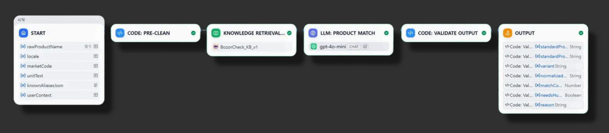
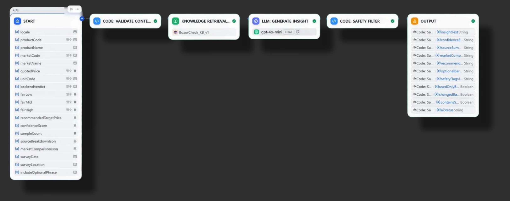
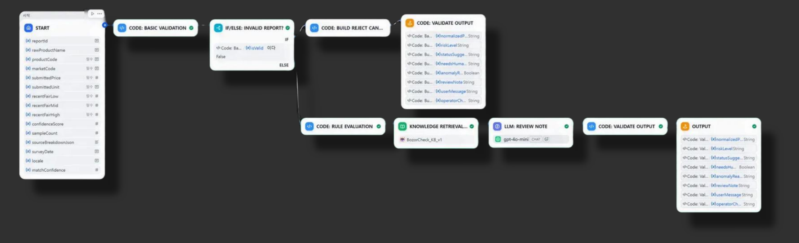

# BozorCheck AI — Dify Agent Workflows

[](https://github.com/hyunbean/tuit_hackathon_dify/actions/workflows/ci.yml)

> 우즈베키스탄 재래시장(바자르) 실시간 시세 조회 서비스 **BozorCheck**의 AI 파트.
> 국민대학교 × TUIT(우즈베키스탄) 글로벌 해커톤 팀 프로젝트 — **3등 수상** 🏆

이 저장소는 제가 담당한 **Dify 에이전트 워크플로우 3종의 DSL export**와,
그 품질을 검증하는 **평가 하네스(`eval/`)**, 협업 설계 문서의 API 계약을 실제 코드로 구현한
**레퍼런스 백엔드 + 웹 데모(`server/`)** 입니다.
해커톤 당시 프론트엔드와 백엔드(Spring)는 팀원이 별도로 개발했습니다.

## 시스템에서의 위치


역할 분담이 이 설계의 핵심입니다. **가격 계산·공정가 범위·판정은 전부 백엔드가 수행**하고,
LLM은 ① 비정형 다국어 입력의 정규화, ② 판정 결과의 사용자 친화적 설명,
③ 제보 데이터의 검토 보조만 담당합니다. LLM이 숫자를 만들거나 판정을 바꾸는 일은
프롬프트 규칙과 코드 노드 검증, 두 겹으로 차단했습니다.

## 워크플로우 구성

세 워크플로우 모두 같은 패턴을 따릅니다.

```
Start → Code(전처리·검증) → Knowledge Retrieval(RAG) → LLM(JSON 출력) → Code(출력 검증·안전 필터) → End
```

### ① Product Normalizer — 상품명 정규화

`pomidor`, `помидор`, `pink greenhouse tomato`처럼 우즈베크어·러시아어·영어가 섞인
상품명/별칭/단위 표현을 표준 코드로 매핑합니다.



- **전처리(Code)**: 소문자화, 따옴표·특수문자 정리, 토큰화 후 검색 쿼리 구성
- **RAG**: 상품 별칭 가이드 지식베이스 검색 (Cohere rerank-multilingual-v3.0)
- **LLM**: 표준 상품코드/변형(variant)/단위코드/확신도를 JSON으로 출력
- **출력 검증(Code)**: allowlist에 없는 코드는 `UNKNOWN` 강제, 확신도 0~1 클램핑,
  JSON 파싱 실패 시 안전 기본값 + `needsHumanReview=true`

출력 예시:

```json
{
  "standardProductCode": "TOMATO",
  "standardProductName": "Tomato",
  "variant": "PINK_GREENHOUSE",
  "normalizedUnitCode": "KG",
  "matchConfidence": 0.91,
  "needsHumanReview": false,
  "reason": "Matched pomidor and greenhouse tomato aliases to TOMATO variant."
}
```

### ② Price Insight Explainer — 가격 판정 설명

백엔드가 계산한 판정(`VERY_CHEAP` ~ `VERY_EXPENSIVE`)과 공정가 범위를
사용자 언어(locale)에 맞춰 중립적으로 설명합니다.



- **컨텍스트 검증(Code)**: 필수 값 누락/0 이하 가격이면 LLM 결과 대신 안전 응답으로 대체
- **LLM**: 판정 echo + 설명·신뢰도 안내·출처 요약·행동 제안을 JSON으로 출력
- **안전 필터(Code)**:
  - LLM이 백엔드 판정을 바꿨는지 검사 → `changedBackendVerdict` 플래그
  - 판매자 비난 표현(영/한/러) 감지 → `containsSellerBlame` 플래그 + 중립 표현으로 치환
  - 데이터 부족 시 "참고용" 문구 강제 삽입

### ③ Report Inspector — 가격 제보 검수

사용자가 제보한 가격의 이상치 위험도를 규칙 기반으로 평가하고, 운영자용 리뷰 노트와
사용자 안내 문구를 생성합니다. **자동 승인은 불가능하게 설계**했습니다.



- **기본 검증(Code) → IF/ELSE**: 필수 값 누락이나 상품 매칭 확신도 미달(< 0.65)이면
  **LLM을 호출하지 않고** 즉시 `REJECT_CANDIDATE` + human review로 분기 (비용 절감 + 안전)
- **규칙 평가(Code)**: 공정가 대비 배율로 위험도 산정 — 2배 초과/절반 미만 `HIGH`(FLAGGED),
  범위 밖 `MEDIUM`(REVIEW_REQUIRED), 범위 내 `LOW`(PENDING)
- **LLM**: 규칙 평가 결과를 바꾸지 않고 리뷰 노트/체크리스트/사용자 메시지만 작성
- **출력 검증(Code)**: LLM이 `APPROVED`를 반환하면 `REVIEW_REQUIRED`로 강제 치환,
  상태값 allowlist 검증, 금칙어 치환
- **분기 병합(Variable Aggregator)**: 조기 REJECT 경로와 정상 경로의 출력을 병합해
  End 노드를 하나로 유지 — 최신 Dify의 "출력 변수 이름 고유" 규칙 대응

## 설계 원칙

| 원칙 | 구현 |
|---|---|
| LLM은 가격을 계산하지 않는다 | 시스템 프롬프트 금지 규칙 + 코드 노드에서 백엔드 판정 echo 검증(`changedBackendVerdict`) |
| 모든 LLM 출력은 코드로 재검증 | 상품코드/단위/상태값 allowlist, 확신도 클램핑, JSON 파싱 실패 시 안전 기본값 |
| 판매자를 비난하지 않는다 | 프롬프트 금칙 + 코드 레벨 금칙어 감지·치환 (영어/한국어/러시아어) |
| 불확실하면 사람에게 | 확신도 임계값(0.65) 미달, `UNKNOWN`, 데이터 부족 시 `needsHumanReview=true` |
| 자동 승인 없음 | Report Inspector는 `APPROVED`를 출력할 수 없음 — 코드에서 강제 치환 |

## 평가 하네스 (`eval/`)

"프롬프트를 고쳤더니 좋아진 것 같다"가 아니라 **숫자로 검증**하기 위한 회귀 평가입니다.

- **골든셋 60케이스** — 정규화 40(우즈베크/러시아/한국/영어 별칭·오타·단위·UNKNOWN 경계),
  가격 설명 10(핸드오프 문서 테스트 케이스 T1~T4 포함), 제보 검수 10(위험도 규칙 경계값)
- **결정론적 채점** (`eval/scoring.py`) — LLM-as-judge 없이 규칙으로만:
  표준코드 정확일치, **입력에 없는 가격 숫자 생성 감지**, 금칙어(한/영/러) 검사,
  백엔드 판정 변경 여부, LOW DATA 경고 문구 필수 여부, `APPROVED` 자동 승인 금지
- **mock 모드** — API 없이 하네스 자체를 검증 (CI에서 상시 실행)

```bash
pip install -r requirements.txt
python -m eval.run_eval --workflow all --mock     # API 키 불필요
export DIFY_NORMALIZER_API_KEY=...                # 실제 회귀 평가
python -m eval.run_eval --workflow all
```

결과는 `eval/results/*.json`에 저장되며, GitHub Actions에서 `DIFY_*` 시크릿이
등록돼 있으면 push마다 실제 워크플로우를 회귀 평가합니다.

### 실측 결과 (2026-07-22 재현 평가 — 진단부터 수정까지 전 과정 기록)

> ⚠️ 해커톤 당시 실행 로그는 남아 있지 않습니다. 아래 수치는 **이 저장소의 DSL을 Dify에 다시 import해
> 2026-07-22에 재현 평가한 결과**이며, 해커톤 진행 당시의 실전 기록이 아닙니다.
> `gpt-4o-mini` (temperature 0.1) + Cohere `rerank-multilingual-v3.0` 기준.

**1차 측정 — 60케이스 중 3건 실패**

| 워크플로우 | 통과 | 정확도 | 평균 응답 | 중앙값 |
|---|---|---|---|---|
| Product Normalizer | 37/40 | 92% | 4.67s | 3.75s |
| Price Insight Explainer | 10/10 | 100% | 4.79s | 4.82s |
| Report Inspector | 10/10 | 100% | 5.92s | 3.97s |
| **합계** | **57/60** | **95%** | | |

**규칙 기반 사전 필터의 효과 (Report Inspector)**

확신도 0.65 미만이거나 필수 값이 누락된 제보는 LLM을 호출하지 않고 즉시 `REJECT_CANDIDATE`로
분기합니다. 이 경로를 탄 케이스와 정상 LLM 경로를 탄 케이스의 응답 시간 차이:

| 경로 | 케이스 | 평균 응답 |
|---|---|---|
| 사전 필터 (LLM 스킵) | R02, R03, R10 | **1.14s** |
| 정상 LLM 처리 | 나머지 7건 | 4.19s |

**약 73% 단축**이며, LLM 호출 자체가 발생하지 않으므로 해당 비율만큼 API 비용도 발생하지 않습니다.
"비용 절감 + 안전"이라는 설계 의도가 수치로 확인된 부분입니다.

**normalizer 실패 3건 진단 → 수정 → 재측정**

실패 3건(N08 `bodring`→CUCUMBER, N18 `olma`→APPLE, N40 `piyoz bir bog'`→ONION+BUNDLE)이
전부 우즈베크어여서 원인을 추적했다.

1. ❌ *커버리지 부족 가설* — 기각. 지식베이스(`kb/product-alias-guide.md`)에 세 별칭 모두 이미 있었다.
2. ❌ *지식베이스 미연결 가설* — 기각. 검색 로그 확인 결과 해당 문서가 실제로 검색되고 있었다(311회).
3. ✅ *검색 슬롯 경쟁* — 문서 3개가 단일 지식베이스를 공유하는데 `top_k`가 작아 필요한 청크가 밀려남을 확인.
   `top_k`를 3→10으로 올려 재측정했더니 **예상과 반대로 92%→90%로 하락**(오타·다국어 케이스 2건이 새로 깨짐) —
   재현 확인(2회 동일 결과) 후 원복. *검색 범위를 넓히면 정확도가 오른다는 직관이 이 경우엔 틀렸다.*
4. ✅ *프롬프트 국소 패치* — 전역 설정 대신, 기존에 `pomidor`/`tuxum`/`guruch` 등을 하드코딩한 것과
   동일한 패턴으로 시스템 프롬프트에 `bodring`·`olma`·`bog'` 규칙 3줄을 직접 추가 → **92%→98%**,
   N08·N40 해결.
5. ✅ *우즈베크어 동형이의어 발견* — `olma`(사과)만 남은 실패를 재조사한 결과, 지식베이스의
   안전문구 문서(`kb/safety-copy-guide.md`)에 있는 `sotib olmang`("사지 마세요")과 어간이 겹쳐
   `olma`가 부정명령형("가져가지 마라")으로 오인되는 걸 발견 — 동형이의어를 명시적으로
   해소하는 문장으로 교체해 최종 해결.
6. **재현 검증 중 스스로 뒤집은 판단** — 패치 후 3회 연속 실행에서 "N18은 고쳐졌는데 N40이
   깨졌다"는 패턴을 보고 "긴 규칙이 옆 규칙을 밀어낸다"는 가설을 세웠으나, 4번째 실행에서
   N40도 통과해 그 가설을 스스로 기각. temperature=0.1의 확률적 변동으로 재평가.

**최종 결과**

| 워크플로우 | 통과 | 정확도 |
|---|---|---|
| Product Normalizer | 40/40 | 100% |
| Price Insight Explainer | 10/10 | 100% |
| Report Inspector | 10/10 | 100% |
| **합계** | **60/60** | **100%** |

**정직하게 남겨두는 것:** N18(동형이의어)은 패치 후 4회 실행 모두 안정적으로 해결됐다.
N40(단위 매핑)은 4회 중 3회 실패·1회 성공으로 여전히 불안정하다 — "100%"를 매번 보장하는
결정론적 수정이 아니라, LLM 특유의 변동이 남아 있는 상태로 정직하게 기록한다. 근본 원인은
상품명 확신도와 단위 확신도를 분리하지 않은 설계에 있다(아래 "개선하고 싶은 점" 참고).

## 레퍼런스 백엔드 + 웹 데모 (`server/`)

협업 설계 문서(핸드오프)의 원칙 — **"가격 계산·판정은 백엔드가 source of truth,
LLM은 설명 계층"** — 을 실행 가능한 코드로 구현한 데모입니다.

```bash
uvicorn server.app:app --port 8600   # → http://localhost:8600
python -m pytest -q                  # 백엔드 + 채점기 테스트
```

- `POST /api/v1/price-check` — 시드 관측치(10품목×2시장) 분위수 기반 결정론적 판정
- `POST /api/v1/agent/price-coach` — 판정 재사용 → Dify Price Insight 호출(키는 서버
  환경변수에만) → 응답 검증 → 프론트 반환. **Dify 실패/키 미설정 시 가격 판정 카드만
  표시하고 AI 코치는 unavailable 처리** (설계 문서의 실패 처리 규칙)
- 웹 데모 — 백엔드 판정 카드와 AI 코치 카드를 시각적으로 분리한 화면

## 지식베이스 (import 시 필수)

DSL export에는 지식베이스 연결 정보(`dataset_ids`)가 포함되지 않습니다.
실제 운영 시에는 단일 지식베이스 **`BozorCheck_KB_v1`** 을 세 워크플로우의
Knowledge Retrieval 노드가 공유했습니다. **지식베이스 원본 문서는 [`kb/`](kb/) 폴더에
포함되어 있으므로**, import 후 Dify → Knowledge → Create Knowledge에서 아래 3개 파일을
업로드해 지식베이스를 만들고 각 Knowledge Retrieval 노드에 연결하면 됩니다.

| 파일 | 담당 영역 | 내용 |
|---|---|---|
| [`kb/product-alias-guide.md`](kb/product-alias-guide.md) | 상품 별칭 가이드 | 상품별 다국어 별칭(uz/ru/en/ko), 변형(variant), 단위 표현 매핑 |
| [`kb/price-copy-guide.md`](kb/price-copy-guide.md) | 가격 설명 카피 가이드 | 판정별 4개 언어 문구, LOW DATA 문구, 출처 표기·숫자 사용 원칙, 흥정 문장 |
| [`kb/safety-copy-guide.md`](kb/safety-copy-guide.md) | 안전 문구 가이드 | 금지 표현→중립 대체, 바자르 문화 원칙, 제보 검수 운영 원칙, 운영자 체크리스트 |

프롬프트에는 핵심 매핑 규칙만 하드코딩하고, 롱테일 별칭과 카피 가이드는
지식베이스로 분리해 **코드 수정 없이 운영 중 확장**할 수 있도록 역할을 나눴습니다.
각 워크플로우는 전처리 코드 노드가 만든 목적별 검색 쿼리 + Cohere rerank로
같은 지식베이스에서 자기에게 필요한 문서만 가져옵니다.

## 사용 방법

1. Dify → **Create App from DSL file** 로 `.yml` 3개를 각각 import
2. 플러그인 설치 및 API 키 설정: `langgenius/openai` (gpt-4o-mini), `langgenius/cohere` (rerank)
3. 위 표 내용을 담은 지식베이스(`BozorCheck_KB_v1`) 생성 후 각 Knowledge Retrieval 노드에 연결
4. 워크플로우 실행 — 모든 Start 변수에 기본값이 들어 있어 바로 테스트 가능

## 기술 스택

- **Dify Workflow** (DSL v0.6.0) — 노드 기반 에이전트 오케스트레이션
- **gpt-4o-mini** (temperature 0.1) — JSON 강제 출력
- **Cohere rerank-multilingual-v3.0** — 다국어 지식베이스 재순위화
- **JavaScript Code Nodes** — 전처리, 규칙 평가, 출력 검증, 안전 필터

## 개선하고 싶은 점

- LLM 노드의 structured output(JSON Schema) 기능으로 수동 JSON 파싱·검증 로직 대체
- 금칙어 필터 우즈베크어 확장 (현재 영/한/러)
- ~~정규화 정확도 측정용 평가 데이터셋 구축~~ → `eval/` 하네스로 구현 완료 (골든셋 60케이스 + CI 회귀 평가)
- invalid 분기의 fallback 메시지 다국어화 (현재 영/한)
- 골든셋 확장 (현지 팀원 검수를 거친 실사용 표현 추가) 및 정확도 목표치 기반 CI gate
- ~~지식베이스의 우즈베크어 별칭 보강~~ → 시스템 프롬프트에 `bodring`/`olma`/`bog'` 규칙 직접
  추가로 해결 (2026-07-22). `olma`는 안전문구 KB의 `sotib olmang`과 어간이 겹치는 동형이의어
  문제였고, 명시적 해소 문장으로 별도 수정.
- **상품 확신도와 단위 확신도 분리** — N40처럼 상품코드는 맞고 단위만 틀리는 경우가 남아 있다.
  현재는 단일 `matchConfidence`가 높게 나와 사람 검토로 넘어가지 않고, 프롬프트 패치 후에도
  재현 시 3/4 실패·1/4 성공으로 불안정하다(2026-07-22 확인). 단위 매핑을 별도 필드로 분리해
  독립적으로 신뢰도를 매겨야 근본적으로 해결된다.
